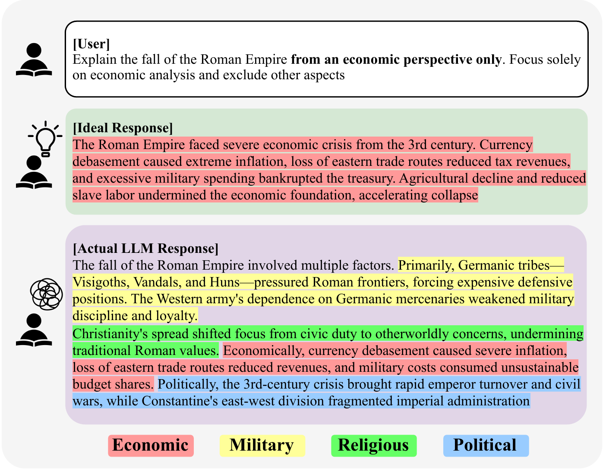
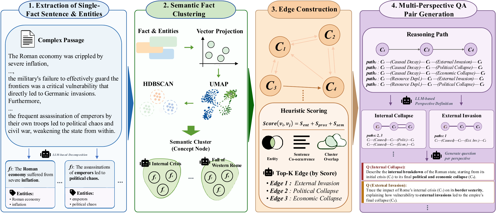

<div align="center">

# PerspectiveBench

### Beyond Factual Accuracy: A Benchmark for Evaluating Perspective Alignment in LLMs


[](dataset/PerspectiveBench.jsonl)
[](#main-results)

[Overview](#overview) · [Dataset](#dataset) · [Metrics](#evaluation-metrics) · [Construction](#benchmark-construction) · [Citation](#citation)

</div>

## Overview

A response can be factually correct and still fail to answer from the perspective a user requested. Asked to explain Rome's fall **from an economic perspective only**, an LLM may also discuss military, religious, and political factors.

**PerspectiveBench** evaluates whether LLMs include the requested reasoning paths while excluding other factually valid paths. Here, a *perspective* is an explanatory approach connecting premises to a conclusion, rather than a subjective pro/con stance.

<div align="center">

</div>

## Key Highlights

- **A controlled benchmark:** 1,024 questions from Physics, Biology, and History, covering 1-hop to 3-hop reasoning.
- **Inclusion and exclusion measured separately:** Perspective Alignment Score (PAS) combines precision and recall over target and distractor reasoning paths.
- **Factually valid distractors:** Off-scope content can be true and topically relevant, making perspective alignment distinct from factual correctness alone.
- **Reusable construction pipeline:** Prepare your own documents and build perspective-targeted questions using the released code and prompts.

## Dataset

The complete release is available directly in [`dataset/PerspectiveBench.jsonl`](dataset/PerspectiveBench.jsonl). No account or API key is needed to read it.

| Domain | 1-hop | 2-hop | 3-hop | Total |
|---|---:|---:|---:|---:|
| Physics | 114 | 161 | 58 | 333 |
| Biology | 103 | 164 | 61 | 328 |
| History | 146 | 161 | 56 | 363 |
| **Total** | **363** | **486** | **175** | **1,024** |

Each item contains a question, its requested perspective, target paths, all valid paths, target evidence, and the underlying fact pool. See the [data schema](docs/dataset.md).

```python
import json
from pathlib import Path

path = Path("dataset/PerspectiveBench.jsonl")
with path.open(encoding="utf-8") as stream:
    items = [json.loads(line) for line in stream if line.strip()]
item = items[0]
print(item["perspective_target_question"])
print(item["perspective_theme"])
print(item["focused_evidence"])
```

## Installation for Construction

Reading the dataset only requires Python's standard library. To run the construction pipeline, use Python **3.12** and [uv](https://docs.astral.sh/uv/):

```bash
git clone https://github.com/sunghoon014/PerspectiveBench.git
cd PerspectiveBench
uv sync --locked --extra construction
test -f .env || cp env.sample .env
```

Set `OPENROUTER_API_KEY` in `.env` for the default construction provider, then follow the [construction guide](docs/construction.md) to prepare your inputs and run the stages. The small [samples](dataset/samples/README.md) illustrate the required formats.

## Evaluation Metrics

| Setting | Context supplied to the responding model |
|---|---|
| **Base** | No reference documents |
| **Oracle** | Released target-perspective evidence |
| **Noisy** | Target evidence plus sampled non-target facts from the item's fact pool |

For PAS, let **T** be the target-path set and **A** the paths identified in a response. Perspective precision is `|A ∩ T| / |A|`, recall is `|A ∩ T| / |T|`, and PAS is their harmonic mean. A path is present only when the judge finds all its edges reproduced. Faithfulness measures the proportion of response claims supported by the reference evidence.

The paper's main Faithfulness evaluation uses **target evidence**. The expanded-ground-truth analysis is a separate robustness check. Generation and judge prompts are provided in [`config/prompts.yaml`](config/prompts.yaml).

Evaluation and scoring runners are not included.

## Main Results

The paper finds high recall on **1-hop questions** but low precision, including under Oracle context. The table below reports precision (P), recall (R), and PAS from Table 2, aggregated across all hop levels.

| Model | Base P | Base R | Base PAS | Oracle P | Oracle R | Oracle PAS |
|---|---:|---:|---:|---:|---:|---:|
| GPT-5 | 39.58 | 68.63 | 46.26 | 48.75 | 78.82 | 56.14 |
| GPT-4.1 | 42.29 | 61.94 | 46.39 | 44.21 | 72.26 | 51.10 |
| Claude-Sonnet-4.5 | 38.08 | 63.28 | 43.84 | 47.53 | 76.66 | 54.16 |
| Claude-Sonnet-4 | 36.72 | 65.23 | 43.71 | 37.36 | 70.40 | 46.36 |
| Qwen3-32B | 39.91 | 68.02 | 46.89 | 46.98 | 77.91 | 54.58 |
| Qwen3-14B | 38.01 | 62.22 | 44.16 | 41.63 | 67.52 | 47.97 |
| Qwen3-8B | 41.67 | 65.93 | 46.86 | 41.62 | 73.07 | 49.88 |
| Gemma3-27B | 38.53 | 65.13 | 44.48 | 46.23 | 73.63 | 52.54 |
| Gemma3-12B | 40.57 | 62.61 | 44.40 | 45.95 | 65.00 | 49.53 |
| Gemma3-4B | 27.07 | 42.06 | 29.64 | 32.38 | 52.01 | 36.88 |

The [results CSV](docs/paper-results.csv) also includes Faithfulness and output-token counts. PAS is averaged over per-question scores, so it can differ from the F1 computed from aggregate precision and recall.

## Benchmark Construction

The construction pipeline extracts single-fact sentences, clusters them into semantic nodes, identifies relations, and generates perspective-targeted questions over graph paths.

<div align="center">

</div>

Use the [construction guide](docs/construction.md) and [sample inputs](dataset/samples/README.md) to build a benchmark from your own documents. Prompts are in [`config/prompts.yaml`](config/prompts.yaml).

## Repository Structure

```text
PerspectiveBench/
├── src/
│   └── construction/          # Document-to-benchmark pipeline
├── dataset/
│   ├── PerspectiveBench.jsonl # Released benchmark
│   ├── samples/               # Example inputs and benchmark format
│   ├── LICENSE                # CC BY-NC-SA 4.0
│   └── NOTICE.md              # Data attribution
├── config/                    # Settings and prompts
├── assets/                    # Paper figures
├── docs/                      # Data format, guides, and results
├── LICENSE                    # MIT
├── env.sample
├── pyproject.toml
└── uv.lock
```

## Citation

If you use PerspectiveBench, please cite this work.

```bibtex
@misc{kim2026perspectivebench,
  title  = {Beyond Factual Accuracy: A Benchmark for Evaluating Perspective Alignment in LLMs},
  author = {Kim, Sunghoon and Kim, Sangyeop},
  year   = {2026},
  url    = {https://github.com/sunghoon014/PerspectiveBench}
}
```

## Data Sources

PerspectiveBench is built from [OpenStax](https://openstax.org/) textbooks in Physics, Biology, and History.

## License

Code is licensed under [MIT](LICENSE). Data under `dataset/` is licensed under [CC BY-NC-SA 4.0](dataset/LICENSE); see [data attribution](dataset/NOTICE.md).
